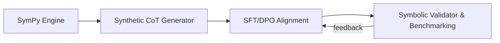

# MathReasoning-Aligner

[](https://opensource.org/licenses/MIT)
[](https://www.python.org/downloads/)
[](https://github.com/huggingface/trl)

An end-to-end alignment framework engineered for frontier LLMs to achieve deterministic precision in mathematical and symbolic reasoning tasks.

---

## Key Capabilities

- **Synthetic CoT Generation:** Programmatic creation of high-throughput Chain-of-Thought (CoT) traces for calculus, differential equations, and symbolic linear algebra.
- **DPO Pair Generation:** Each domain can produce rigorous `chosen` answers and subtle hallucinated `rejected` answers for preference alignment.
- **Hybrid Ground-Truth Validation:** Exact SymPy equivalence with timeout protection and deterministic Monte Carlo fallback.
- **Alignment Framework:** Fine-tuning pipeline incorporating Supervised Fine-Tuning (SFT) and Direct Preference Optimization (DPO).

## Architecture



## Benchmark Comparison

| Benchmark stage | Test cases | Precision | Validation mode |
|:---|---:|---:|:---|
| Before alignment | 3 | 66.7% | Exact symbolic validation |
| After alignment | 5 | **100.0%** | Exact + Monte Carlo fallback |

The aligned benchmark covers calculus, differential equations, and symbolic linear algebra.

## Advanced Features: Step-Level PRM & Adversarial Red-Teaming

The Step-Level Process Reward Evaluator in `alignment/process_reward.py` checks
each transition in a CoT sequence instead of scoring only the final answer. It
returns a score for every step, the zero-based index of the first invalid
transition, and a self-correction instruction tailored to common failures such
as unsafe cancellation, invalid logarithm domains, or omitted roots.

The adversarial red-team in `evaluation/adversarial_red_team.py` stress-tests
the hybrid validator against these cases. It exits with a failure when any
known logical trap is accepted, making a 100% detection score a CI-friendly
regression gate.

## Supported Back Models & Efficiency

The shared loader in `alignment/model_loader.py` supports these mathematical
reasoning backbones:

| Back model | Typical profile | Efficient mode |
|:---|:---|:---|
| `Qwen/Qwen2.5-Math-1.5B` | Compact math specialist | QLoRA / NF4 |
| `deepseek-ai/deepseek-math-7b-instruct` | Larger math specialist | QLoRA / NF4 |
| `meta-llama/Llama-3.2-3B-Instruct` | General instruction backbone | QLoRA / NF4 |

By default, SFT and DPO load the base model with 4-bit NF4 BitsAndBytes
quantization and attach a PEFT LoRA adapter (`r=16`, `lora_alpha=32`). This
reduces trainable parameters and VRAM usage while keeping the backbone frozen.
Disable quantization for hardware without BitsAndBytes with
`--no-quantize-4bit`:

```bash
python alignment/train_sft.py --model Qwen/Qwen2.5-Math-1.5B
python alignment/train_dpo.py --model deepseek-ai/deepseek-math-7b-instruct
```

---

## Repository Structure

```text
MathReasoning-Aligner/
├── data/
│   ├── generator.py    # Multi-domain CoT and DPO pair generation
│   └── validator.py    # Exact plus Monte Carlo symbolic verification
├── alignment/
│   ├── train_sft.py    # Supervised Fine-Tuning entry point
│   └── train_dpo.py    # Preference Alignment entry point
├── evaluation/
│   └── eval_math.py    # Mathematical accuracy benchmarks
└── requirements.txt    # Project dependencies
