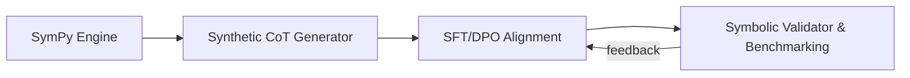

# MathReasoning-Aligner

[](https://opensource.org/licenses/MIT)
[](https://www.python.org/downloads/)
[](https://github.com/huggingface/trl)

An end-to-end alignment framework engineered for frontier LLMs to achieve deterministic precision in mathematical and symbolic reasoning tasks.

---

## Key Capabilities

- **Synthetic CoT Generation:** Programmatic creation of high-throughput Chain-of-Thought (CoT) traces for calculus, differential equations, and symbolic linear algebra.
- **DPO Pair Generation:** Each domain can produce rigorous `chosen` answers and subtle hallucinated `rejected` answers for preference alignment.
- **Hybrid Ground-Truth Validation:** Exact SymPy equivalence with timeout protection and deterministic Monte Carlo fallback.
- **Alignment Framework:** Fine-tuning pipeline incorporating Supervised Fine-Tuning (SFT) and Direct Preference Optimization (DPO).

## Architecture



## Benchmark Comparison

| Benchmark stage | Test cases | Precision | Validation mode |
|:---|---:|---:|:---|
| Before alignment | 3 | 66.7% | Exact symbolic validation |
| After alignment | 5 | **100.0%** | Exact + Monte Carlo fallback |

The aligned benchmark covers calculus, differential equations, and symbolic linear algebra.

---

## Repository Structure

```text
MathReasoning-Aligner/
├── data/
│   ├── generator.py    # Multi-domain CoT and DPO pair generation
│   └── validator.py    # Exact plus Monte Carlo symbolic verification
├── alignment/
│   ├── train_sft.py    # Supervised Fine-Tuning entry point
│   └── train_dpo.py    # Preference Alignment entry point
├── evaluation/
│   └── eval_math.py    # Mathematical accuracy benchmarks
└── requirements.txt    # Project dependencies
